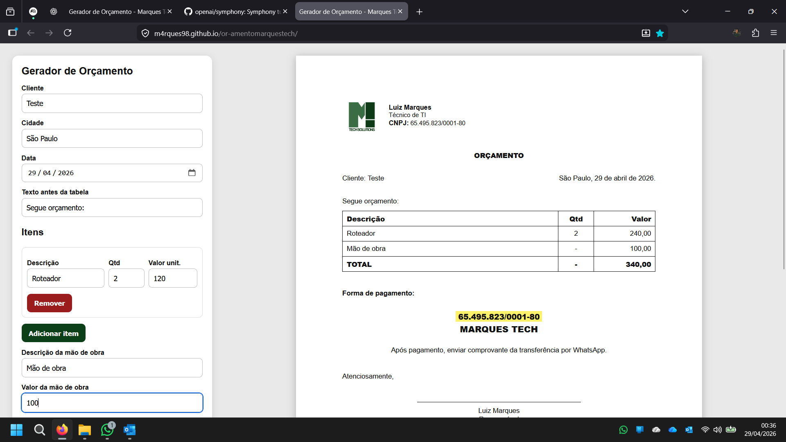

# 🧾 Gerador de Orçamento - Marques Tech

Ferramenta web simples para geração de orçamentos profissionais em PDF.

## 🚀 O que faz

- Preenchimento de dados do cliente
- Data automática (editável)
- Adição de múltiplos itens com:
  - Quantidade
  - Valor unitário
  - Cálculo automático
- Campo de mão de obra editável
- Forma de pagamento personalizada
- Geração de orçamento pronto para impressão em A4
- Layout profissional com identidade da Marques Tech

## 📄 Como usar

1. Acesse o sistema:
👉 https://m4rques98.github.io/orcamentomarquestech/

2. Preencha:
- Nome do cliente
- Itens
- Valores
- Mão de obra

3. Clique em **Imprimir / Salvar PDF**

## 🖥️ Preview

## 📌 Observações

- Layout otimizado para impressão em folha A4
- Quebra automática de página para muitos itens
- Não necessita instalação (roda direto no navegador)

---

**Desenvolvido por Marques Tech 🚀**
